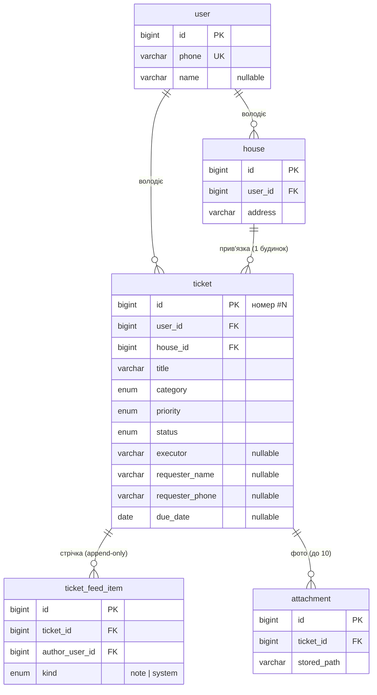

# PRD — Сервіс-деск Mini (POC агентної розробки)

> **Статус документа:** чернетка для старту розробки
> **Версія:** 1.2 · **Створено:** 2026-07-06 · **Оновлено:** 2026-07-07
> **Супутні документи:** [глосарій](./glossary.md) · [журнал рішень/припущень/питань](./assumptions-open-questions.md) · [реєстр ADR](./adr/README.md) · [план агентних циклів](./agent-plan.md)
> **Походження:** спрощення повного PRD «Сервіс-деск „Моє ОСББ“» (v1.11) з репозиторію
> специфікації `service-desk-prd`. Згадки документів і рішень того проєкту (кореневі
> PRD/ADR, рішення `Р-`) — довідкові назви, а не посилання в цьому репозиторії.
>
> **Конвенція кодування вимог (SDD).** Як у повному PRD: нормативні спец-айтеми мають
> стабільні коди `<ПРЕФІКС>-<КАТЕГОРІЯ>-<NN>`:
> **FR-** — функціональна вимога (§7) · **NFR-** — нефункціональна вимога (§8) ·
> **TC-** — технічне обмеження (§1.3) · **BC-** — бізнес-обмеження (§2.3).
> Простір кодів POC **окремий** від повного PRD — однакові коди тут і там не пов'язані.
> Журнал `Р-/П-/В-` ведеться у **спрощеному вигляді** — [assumptions-open-questions.md](./assumptions-open-questions.md)
> (без трекерів `М-/Б-/Т-/РИ-`). Інженерні рішення фіксуються **ADR**; продуктові —
> записом `Р-` у журналі + правкою цього PRD (журнал змін §12). Ведення підтримує скіл
> `/record-decision` (створюється в Е-1).

---

## Зміст

1. [Огляд і контекст](#1-огляд-і-контекст)
2. [Межі MVP](#2-межі-mvp)
3. [Цілі та критерії успіху](#3-цілі-та-критерії-успіху)
4. [Користувачі](#4-користувачі)
5. [Модель заявки](#5-модель-заявки)
6. [Сценарії](#6-сценарії)
7. [Функціональні вимоги](#7-функціональні-вимоги)
8. [Нефункціональні вимоги](#8-нефункціональні-вимоги)
9. [Модель даних](#9-модель-даних)
10. [Що свідомо викинуто з повного продукту](#10-що-свідомо-викинуто-з-повного-продукту)
11. [Ризики](#11-ризики)
12. [Журнал змін](#12-журнал-змін)

---

## 1. Огляд і контекст

### 1.1. Що це і навіщо

**Сервіс-деск Mini** — самостійний мінімальний застосунок для ручного ведення заявок
(на кшталт заявок мешканців будинків): створення, класифікація, трекінг статусів,
фото-вкладення, записи. Він **не інтегрується** з платформою «Моє ОСББ» і не має
зовнішніх залежностей, крім SMS-шлюзу для OTP.

Первинна мета проєкту — **не продукт, а процес**: це POC **агентної розробки за
методологією SDD** (spec-driven development). На цьому маленькому проєкті ми:

- налаштовуємо та обкатуємо агентні цикли розробки (5–7 етапів, [план](./agent-plan.md));
- оцінюємо якість результату, витрачені ресурси (час, токени, кошти);
- дивимось на згенерований UI, щоб оцінити зручність і сформувати правки/нові вимоги
  для основного проєкту.

Продуктова основа взята з повного PRD, але радикально спрощена, щоб увесь обсяг
закривався за 5–7 агентних циклів.

### 1.2. Модель продукту

На відміну від повного продукту (менеджер організації з tenant-межею з бази «Моє ОСББ»),
тут діє модель **особистого воркспейсу**:

- будь-хто реєструється самостійно за номером телефону через **OTP по SMS**;
- кожен користувач бачить і веде **лише власні** дані: свій довідник будинків і свої
  заявки. Спільної видимості, організацій і ролей немає;
- заявники (мешканці) **вносяться вручну** текстовими полями на заявці — жодних
  довідників мешканців.

### 1.3. Технічні обмеження (TC)

Стек успадковано від основного проєкту, щоб POC був показовим саме для нього
(деталі й обґрунтування — в [ADR](./adr/README.md)):

| Код | Обмеження | Джерело |
|---|---|---|
| **TC-STACK-01** | Монорепо **Nx**; фронтенд **Angular SPA**; бекенд **NestJS + Prisma**; API **REST/JSON + OpenAPI**; БД **MySQL**. | ADR-0001 |
| **TC-STACK-02** | **Один сервіс, один контейнер**: NestJS роздає статику SPA; окремого reverse-proxy та окремого фронт-сервісу немає. | ADR-0002 |
| **TC-OPS-01** | Розгортання — **Docker-образ на Railway**; секрети — лише в змінних середовища; TLS дає платформа. | ADR-0005 |
| **TC-MEDIA-01** | Вкладення зберігаються **на локальному диску сервера** (Railway Volume), не в S3. Наслідок: один інстанс застосунку, горизонтальне масштабування поза скоупом. | ADR-0003 |
| **TC-AUTH-01** | Автентифікація — лише **OTP по SMS (TurboSMS)**; паролів немає. У dev/test-режимі SMS не надсилається (код у лог). | ADR-0004 |
| **TC-UI-01** | Адаптивний веб, **мобільний-пріоритет**; тільки сучасні evergreen-браузери. | §8 |

---

## 2. Межі MVP

### 2.1. Що входить

Користувач у застосунку:

- реєструється / входить за телефоном через OTP (SMS);
- веде **довідник своїх будинків** (мінімальний CRUD: назва + адреса);
- створює заявку: назва, опис, **будинок** з довідника, заявник (ПІБ + телефон,
  вручну), категорія, пріоритет, необов'язковий **цільовий термін**;
- вказує **виконавця** текстовим полем (без довідника);
- веде **статуси** заявки за 5-статусним життєвим циклом;
- прикріплює **фото** до заявки, переглядає та видаляє їх;
- лишає **записи** у стрічці заявки; системні події (зміна статусу тощо)
  фіксуються в тій самій стрічці автоматично;
- бачить **список заявок** із фільтрами (статус, будинок, категорія, пріоритет),
  простим пошуком і **підсвічуванням прострочених**.

### 2.2. Чого свідомо немає

- Інтеграції з «Моє ОСББ»: синхронізації, реплік, проєкцій, tenant-меж із бази.
- Організацій, ролей, спільної видимості, керування користувачами — кожен бачить
  лише своє.
- Довідників мешканців і виконавців; походження/джерела звернення.
- Спільних об'єктів (котельня/шлагбаум) і мультибудинкових заявок — заявка завжди
  прив'язана до **одного** будинку.
- Сповіщень будь-кому; жорстких SLA, ескалацій, автопереходів.
- Окремої «Історії змін» — системні події пишуться в єдину стрічку заявки.
- Не-зображень (PDF/документи), обробки зображень (ресайз/EXIF), S3.
- Повнотекстового пошуку — лише простий LIKE-пошук.
- Staging-середовища — лише local + prod.

### 2.3. Бізнес-обмеження (BC)

| Код | Бізнес-обмеження |
|---|---|
| **BC-GOAL-01** | Головна мета — **POC агентної розробки**: обсяг має закриватися за **5–7 агентних циклів**. Будь-яка функція, що не вміщується, — викидається або спрощується. |
| **BC-PRIN-01** | **Простота понад повноту**: успадкований фільтр «не складніше за блокнот». Кожна вимога — мінімальна робоча версія, без запасу «на майбутнє». |
| **BC-COST-01** | Витрати POC (Railway, TurboSMS, токени агентів) — мінімальні й **вимірювані**: облік по кожному циклу (див. [план](./agent-plan.md)). У dev SMS не надсилаються. |

---

## 3. Цілі та критерії успіху

### 3.1. Цілі POC (первинні)

1. **Обкатати агентну розробку за SDD** на реалістичному, але малому проєкті
   з цільовим стеком (Angular + NestJS + Nx + Railway).
2. **Виміряти** ресурси: час на цикл, токени/кошти, кількість ітерацій правок,
   дефекти після циклу.
3. **Оцінити якість** результату: код, архітектурна дисципліна (чи дотримано ADR),
   зручність згенерованого UI.
4. Сформувати **висновки та правки вимог** для основного проєкту.

### 3.2. Продуктовий критерій готовності

Робочий застосунок на проді (Railway), у якому реальний користувач може: зареєструватися
за своїм телефоном (SMS приходить), завести будинок, створити заявку з фото, провести її
за життєвим циклом до закриття й знайти в списку з фільтрами. Усі FR §7 закриті, NFR §8
дотримані.

### 3.3. Критерії успіху POC

- Проєкт закрито за **≤7 агентних циклів**; по кожному зібрані метрики (час, кошти,
  ітерації, дефекти).
- Продуктовий критерій §3.2 досягнуто.
- Є письмова ретроспектива: що агентна розробка робить добре/погано на цьому стеку,
  які правки внести в методологію та вимоги основного проєкту.

---

## 4. Користувачі

**Єдина роль — «користувач»** (self-service):

- реєструється сам: телефон → OTP по SMS → акаунт; ім'я — необов'язкове поле профілю;
- працює лише зі **своїми** будинками та заявками; чужих даних не бачить і не може
  побачити навіть за прямим URL (404-стиль, FR-ACCESS-01);
- жодних адміністраторів, ролей чи керування іншими користувачами в застосунку немає.

**Пасивні суб'єкти** (дані, не користувачі): **заявник** — ПІБ/телефон текстом на заявці;
**виконавець** — текстове поле на заявці.

---

## 5. Модель заявки

Перенесена з повного PRD (§5) без змін по суті — вона вже мінімальна.

### 5.1. Життєвий цикл — 5 статусів

- **Активні:** `Нова`, `В роботі` — заявка може бути простроченою.
- **Завершальні:** `Виконана`, `Закрита`, `Відхилена` — підсвічування не діє.

| З | До | Дія |
|---|---|---|
| Нова | В роботі | взято в роботу |
| Нова | Відхилена | не виконуємо |
| В роботі | Виконана | роботу завершено |
| В роботі | Відхилена | не виконуємо |
| Виконана | В роботі | повторне відкриття |
| Виконана | Закрита | підтверджено й закрито |

Правила: усі переходи — ручні; `Закрита` й `Відхилена` — термінальні; зміна атрибутів
(виконавець, категорія, пріоритет, термін, будинок) статусу не змінює.

### 5.2. Категорії (фіксований перелік)

1. Сантехніка (водопостачання, каналізація) · 2. Опалення / теплопостачання ·
3. Електропостачання · 4. Ліфт · 5. Покрівля та фасад · 6. Під'їзд і МЗК ·
7. Прибудинкова територія / благоустрій · 8. Домофон / шлагбаум / відеоспостереження ·
9. Інше

### 5.3. Пріоритети

**Аварійна · Висока · Звичайна** (3 рівні); типове значення — «Звичайна».

### 5.4. Цільовий термін і прострочення

Ручна необов'язкова дата. Заявка **прострочена**, якщо термін задано, він минув і статус
активний. Прострочення лише **візуально підсвічується** — жодних автодій.

### 5.5. Єдина стрічка заявки

Одна хронологічна **append-only** стрічка з двох типів елементів:

- **запис** — ручний текстовий внесок користувача;
- **системна подія** — автоматична фіксація зміни статусу, виконавця, терміну,
  будинку, категорії, пріоритету, додавання/видалення вкладення.

Записи не редагуються й не видаляються. _(Спрощення проти повного PRD: там «Записи» та
«Історія змін» — дві окремі стрічки.)_

---

## 6. Сценарії

Короткі user stories (все — від імені єдиної ролі «користувач»):

- **S1.** Я реєструюся за номером телефону з кодом із SMS, щоб почати вести заявки.
- **S2.** Я заводжу свої будинки один раз, щоб потім прив'язувати до них заявки.
- **S3.** Мені подзвонив мешканець — я створюю заявку з його слів: обираю будинок,
  вписую заявника, категорію, пріоритет, за потреби термін і фото.
- **S4.** Я домовився з майстром — вписую його в поле «виконавець» і переводжу заявку
  «В роботу»; хід справи фіксую записами.
- **S5.** Роботу зроблено — я позначаю «Виконана», а після перевірки — «Закрита»;
  якщо проблема повернулась — повторно відкриваю.
- **S6.** Я відкриваю список, фільтрую по будинку/статусу та одразу бачу підсвічені
  прострочені заявки, щоб нічого не забути.
- **S7.** Через місяць я знаходжу пошуком стару заявку та бачу в стрічці всю історію:
  хто, що і коли робив, з фото «до/після».

Happy-path: вхід → (будинок уже є) → «Нова заявка» → заповнив → фото → «В роботу» →
записи → «Виконана» → «Закрита». Мінімум екранів: список / картка заявки / форма /
будинки / вхід.

---

## 7. Функціональні вимоги

> Кожна вимога — нормативна й тестована. Формат: код · формулювання.

### 7.1. Автентифікація (FR-AUTH)

| Код | Вимога |
|---|---|
| **FR-AUTH-01** | Система дозволяє **реєстрацію та вхід за номером телефону** (нормалізований формат +380…) через одноразовий **OTP-код**, надісланий SMS. Перший успішний вхід номера створює акаунт; наступні — входять у наявний. Паролів немає. |
| **FR-AUTH-02** | OTP: 6 цифр; TTL ≤ 5 хв; одноразовий; ≤ 5 невдалих спроб на код, після чого код анулюється. |
| **FR-AUTH-03** | Rate-limit надсилання OTP: не частіше 1 SMS на номер за 60 с і ≤ 5 SMS на номер за добу. Перевищення — зрозуміла помилка користувачу. |
| **FR-AUTH-04** | Сесія після входу зберігається так, щоб користувач не вводив OTP при кожному візиті (тривалість ≥ 30 днів або до виходу). Є явна дія «Вийти». |

### 7.2. Довідник будинків (FR-HOUSE)

| Код | Вимога |
|---|---|
| **FR-HOUSE-01** | Користувач створює, редагує та переглядає **свої** будинки: **назва/адреса** (обов'язкова, текст) + необов'язкова примітка. |
| **FR-HOUSE-02** | Будинок, до якого прив'язана хоча б одна заявка, **видалити не можна** (зрозуміла помилка); будинок без заявок — можна. |

### 7.3. Заявка: створення та редагування (FR-TICKET)

| Код | Вимога |
|---|---|
| **FR-TICKET-01** | Створення заявки з полями: **назва** (обов'язкова), опис, **будинок** з довідника (обов'язковий), заявник — **ПІБ** та **телефон** (обидва необов'язкові, текст), **категорія** (обов'язкова, §5.2), **пріоритет** (§5.3, за замовчуванням «Звичайна»), **виконавець** (необов'язковий, текст), **цільовий термін** (необов'язкова дата). |
| **FR-TICKET-02** | Кожна заявка має наскрізний **номер** (#N), що показується у списку та картці. |
| **FR-TICKET-03** | Усі поля FR-TICKET-01 можна змінити після створення; зміни будинку, категорії, пріоритету, виконавця й терміну фіксуються **системними подіями** у стрічці (FR-FEED-02). |
| **FR-TICKET-04** | Заявка автоматично зберігає **дату-час створення** та **автора-власника**; видалення заявок немає (небажана заявка — статус `Відхилена`). |

### 7.4. Статуси (FR-STATUS)

| Код | Вимога |
|---|---|
| **FR-STATUS-01** | Заявка завжди має рівно один статус із 5 (§5.1); нова заявка створюється у статусі `Нова`. |
| **FR-STATUS-02** | Система дозволяє **лише** переходи з таблиці §5.1 — і на рівні UI (доступні кнопки), і на рівні API (заборонений перехід → помилка). |
| **FR-STATUS-03** | Кожна зміна статусу фіксується системною подією у стрічці (хто, коли, з якого статусу в який). |

### 7.5. Цільовий термін (FR-DUE)

| Код | Вимога |
|---|---|
| **FR-DUE-01** | Цільовий термін — ручна необов'язкова дата; задається при створенні або пізніше; може бути очищена. |
| **FR-DUE-02** | Прострочені заявки (визначення §5.4) **візуально підсвічуються** у списку та картці. Жодних автодій. |

### 7.6. Стрічка заявки (FR-FEED)

| Код | Вимога |
|---|---|
| **FR-FEED-01** | Користувач додає до заявки текстові **записи**; кожен елемент стрічки має автора й дату-час; стрічка append-only (без редагування й видалення), хронологічна. |
| **FR-FEED-02** | **Системні події** (зміни статусу/полів за FR-TICKET-03 та FR-STATUS-03, додавання/видалення вкладень) автоматично додаються в ту саму стрічку й візуально відрізняються від записів. |

### 7.7. Вкладення (FR-ATTACH)

| Код | Вимога |
|---|---|
| **FR-ATTACH-01** | До заявки можна прикріпити **зображення** (JPEG/PNG/WebP/HEIC): ≤ 10 МБ на файл, ≤ 10 файлів на заявку. Інші типи та розміри відхиляються зі зрозумілою помилкою. |
| **FR-ATTACH-02** | Вкладення переглядаються в картці заявки (мініатюри + повний розмір) і можуть бути **видалені**; видалення фіксується системною подією (FR-FEED-02). |
| **FR-ATTACH-03** | Файли зберігаються на локальному диску сервера (TC-MEDIA-01) і **роздаються лише через API з перевіркою власника** — прямого публічного доступу до файлів немає (NFR-SEC-03). |

### 7.8. Список і пошук (FR-LIST)

| Код | Вимога |
|---|---|
| **FR-LIST-01** | Список заявок користувача показує: номер, назву, будинок, категорію, пріоритет, статус, термін (з підсвічуванням прострочення), дату створення. |
| **FR-LIST-02** | Фільтри: **статус** (зокрема пресет «активні»), **будинок**, **категорія**, **пріоритет**; фільтри комбінуються. |
| **FR-LIST-03** | Простий текстовий **пошук** (LIKE) за назвою, описом, заявником і виконавцем. |
| **FR-LIST-04** | Сортування за датою створення (за замовчуванням — новіші згори) та за цільовим терміном; пагінація або нескінченний скрол від ~50 записів. |

### 7.9. Доступ (FR-ACCESS)

| Код | Вимога |
|---|---|
| **FR-ACCESS-01** | Кожен запит до будинку, заявки, елемента стрічки чи вкладення перевіряє **власника**; чужий або неіснуючий об'єкт → відповідь у стилі **404** (без розрізнення «немає» / «не ваше»). |

---

## 8. Нефункціональні вимоги

| Код | Вимога |
|---|---|
| **NFR-PERF-01** | На POC-обсягах (сотні заявок, десятки фото) список і картка відкриваються ≤ 1 с (p95, без урахування мережі). |
| **NFR-SEC-01** | Сесія — **httpOnly + Secure + SameSite=Lax** cookie (один origin, TC-STACK-02); OTP-коди зберігаються лише як хеші; телефони й коди не пишуться у логи у відкритому вигляді. |
| **NFR-SEC-02** | Rate-limit та TTL OTP за FR-AUTH-02/03 діють на рівні бекенду (не лише UI). |
| **NFR-SEC-03** | Ізоляція власника (FR-ACCESS-01) — на рівні кожного API-ендпоінта й роздачі файлів; це безпекова межа, не UX-фільтр. |
| **NFR-SEC-04** | Секрети (TurboSMS, БД) — лише в змінних середовища (TC-OPS-01); у репозиторії секретів немає. |
| **NFR-REL-01** | Бекапи БД — засобами Railway (добові). Втрата вкладень при втраті volume — прийнятний ризик POC (зафіксовано, ADR-0003). |
| **NFR-STOR-01** | Вкладення — на персистентному **Railway Volume**; шлях монтування конфігурується env-змінною; застосунок працює в **один інстанс** (TC-MEDIA-01). |
| **NFR-COMPAT-01** | Адаптивний UI, мобільний-пріоритет (TC-UI-01): основні сценарії §6 зручні зі смартфона; десктоп — повноцінний. |
| **NFR-OBS-01** | Структуровані логи (запити, помилки, надсилання OTP без PII) + health-ендпоінт для Railway. Повноцінна спостережуваність — поза скоупом. |

---

## 9. Модель даних

### 9.1. Сутності

- **user** — акаунт: `id`, `phone` (unique, нормалізований), `name?`, `created_at`.
- **house** — будинок користувача: `id`, `user_id`, `address` (назва/адреса), `note?`,
  `created_at`.
- **ticket** — заявка: `id` (він же номер #N, BIGINT AI), `user_id`, `house_id`,
  `title`, `description?`, `category` (enum §5.2), `priority` (enum §5.3),
  `status` (enum §5.1), `executor?` (текст), `requester_name?`, `requester_phone?`,
  `due_date?`, `created_at`, `updated_at`.
- **ticket_feed_item** — елемент єдиної стрічки: `id`, `ticket_id`, `author_user_id`,
  `kind` (`note` | `system`), `text` (для note) / `event_payload` (для system: тип події,
  старе→нове значення), `created_at`. Append-only.
- **attachment** — вкладення: `id`, `ticket_id`, `stored_path`, `original_name`,
  `mime`, `size_bytes`, `created_at`.
- **otp_code** — транзитний стор OTP/rate-limit (ADR-0004): `phone`, `code_hash`,
  `expires_at`, `attempts`, `sent_at`, лічильники добового ліміту.

### 9.2. ER-діаграма

Конвенції: BIGINT AI первинні ключі; enum-и — на рівні схеми; індекси під фільтри
списку (`user_id + status`, `user_id + house_id`) — деталізує розробка.

---

## 10. Що свідомо викинуто з повного продукту

Для трасування до повного PRD (v1.11) — що саме спрощено й куди воно повернеться
(у POC не повертається — це межа скоупу, BC-GOAL-01):

| Повний продукт | У POC |
|---|---|
| Синхронізація з «Моє ОСББ» (реплика, проєкції, воркер) | Немає; будинки — ручний довідник, заявники — текст |
| Tenant-межа з бази, організації, спільна видимість, головний менеджер | Особистий воркспейс: власник бачить лише своє |
| Спільні об'єкти, мультибудинкові заявки | Заявка = один будинок |
| Походження заявки та джерело звернення | Викинуто |
| Довідник виконавців (типи підрядник/майстер) | Текстове поле «виконавець» |
| Дві стрічки: Записи + Історія змін | Одна стрічка: записи + системні події |
| S3-сумісне сховище, підписані URL, обробка зображень | Локальний диск (Railway Volume), роздача через API, без обробки |
| FULLTEXT/ngram-пошук | LIKE-пошук |
| Керування користувачами (створення/деактивація менеджерів) | Немає |
| Staging-середовище | local + prod |
| Viber-канали, сповіщення | Немає (SMS — лише для OTP) |

---

## 11. Ризики

| Ризик | Вплив | Пом'якшення |
|---|---|---|
| **Втрата Railway Volume** → втрата фото | Середній (дані POC) | Прийнято свідомо (NFR-REL-01); БД бекапиться платформою; для POC припустимо |
| **Відкрита реєстрація** → спам-акаунти, витрата SMS-бюджету | Середній | Rate-limit FR-AUTH-03; dev-режим без SMS; за потреби — швидке додавання allowlist (тривіальна правка) |
| **Обсяг не вміщується у 5–7 циклів** | Високий для мети POC | BC-GOAL-01: різати функціонал, не розтягувати цикли; план перегляду — [agent-plan.md](./agent-plan.md) |
| **HEIC з iPhone** не відображається в браузерах | Низький | Прийняти лише JPEG/PNG/WebP, якщо HEIC ускладнює (рішення в циклі Е-6, фіксується правкою FR-ATTACH-01) |

---

## 12. Журнал змін

| Дата | Зміна |
|---|---|
| 2026-07-06 | **v1.0:** створено PRD POC на основі повного PRD v1.11. Зафіксовано рішення сесії: ручний довідник будинків; відкрита реєстрація з приватними заявками (особистий воркспейс); повний 5-статусний життєвий цикл; виконавець — текстове поле; вкладення — локальний диск (Railway Volume); OTP — SMS TurboSMS з dev-фолбеком; одна стрічка замість «Записи + Історія змін». |
| 2026-07-07 | Документацію перенесено з репозиторію специфікації `service-desk-prd` (тека `poc/`) до `service-desk-min-app/docs/` — репозиторію реалізації. Правки лише формулювань про походження; зміст вимог без змін. |
| 2026-07-07 | **v1.1:** додано [глосарій](./glossary.md) (v1.0) як супутній нормативний документ — єдине джерело термінології POC. Зміст вимог без змін. |
| 2026-07-07 | **v1.2:** запроваджено спрощений журнал `Р-/П-/В-` — [assumptions-open-questions.md](./assumptions-open-questions.md) (Р-10; замінює рішення v1.0 «журнал не ведеться»). Рішення підготовчих сесій заднім числом отримали коди Р-01…Р-09. Зміст вимог без змін. |
